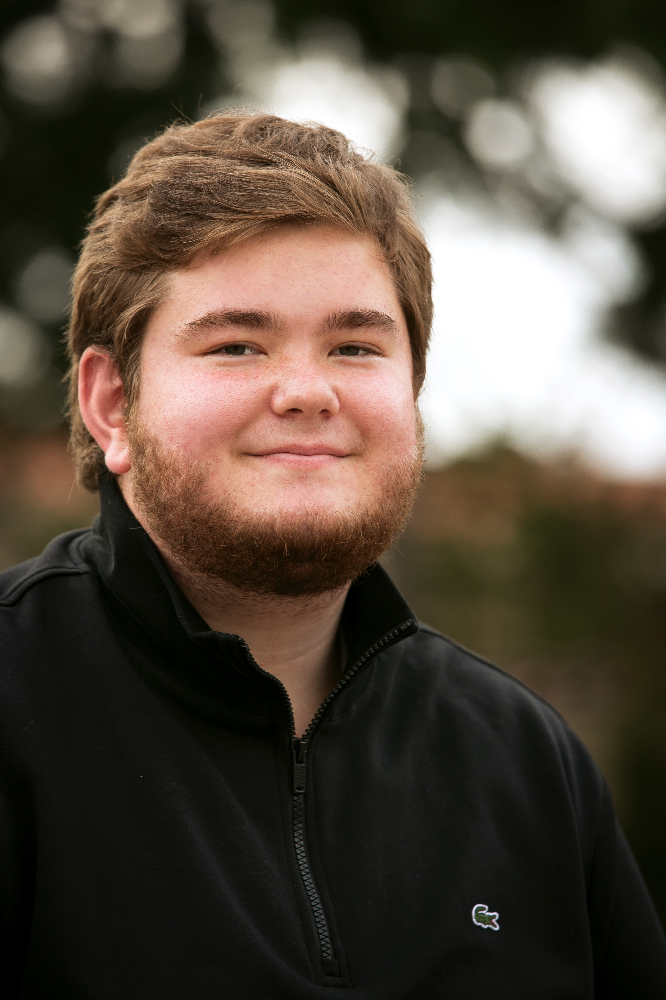

```{r, echo=FALSE, out.width='25%', out.extra='style="float:right;padding:20px"'}

```
<!-- {width=20%} -->


I am a master's student in the [Department of Biomedical Engineering](https://www.bme.jhu.edu/) at the [Johns Hopkins Whiting School of Engineering](https://engineering.jhu.edu/) and a graduate research assistant in the [Department of Biostatistics](https://www.jhsph.edu/departments/biostatistics/) at the [Johns Hopkins Bloomberg School of Public Health](https://www.jhsph.edu/). My thesis work is on the [Open Case Studies](https://www.opencasestudies.org/) project from the [Johns Hopkins Data Science Lab](https://jhudatascience.org/) and advised by [Dr. Carrie Wright](https://carriewright11.github.io/). Learn more about my work in [projects](./projects.html).

I find the brain fascinating and want to further our understanding of it. I am excited by the discoveries made possible by computational models and analyses in cognition/neuroscience and want to contribute to these pursuits. Throughout my program I've focused my studies on [neuroengineering](https://www.bme.jhu.edu/research/research-areas/neuroengineering/) and [biomedical data science](https://www.bme.jhu.edu/research/research-areas/biomedical-data-science/). The [courses](./coursesskills.html) I've taken and my research experiences have allowed me to wrangle, analyze, and visualize real biological data including brain images, neural recordings, covid-19 cases and more. Post graduation, I hope to gain industry experience as a data scientist working with neurological data. Eventually, I plan to pursue a Ph.D in computational neuroscience.\  


<center>
{width=500px}
</center>
