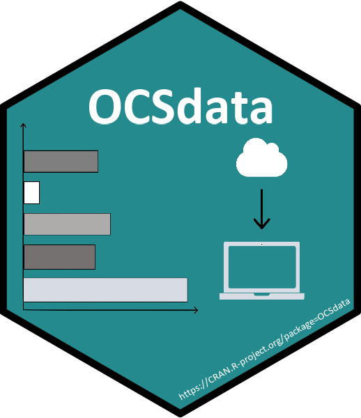

## Open Case Studies | [Johns Hopkins Data Science Lab](https://jhudatascience.org/)

```{r, echo=FALSE, out.width='25%', out.extra='style="float:right;padding:20px"'}
knitr::include_graphics('./OCS_icon.png')
```

[Open Case Studies (OCS)](https://www.opencasestudies.org/) is a repository of open source data science case studies on current public health problems using real data. My project is updating the current case studies by removing barriers, implementing interactive elements, and expanding reach. My master's thesis will analyze the impact of these updates on data science education inside and outside the classroom. \


&nbsp;
&nbsp;
&nbsp;
&nbsp;
&nbsp;


### [OCSdata](https://github.com/opencasestudies/OCSdata) - R Package

```{r, echo=FALSE, out.width='25%', out.extra='style="float:left;padding:20px"'}

```
All the case study data is available in their respective [OCS GitHub](https://github.com/opencasestudies) repositories. However, case study users new to GitHub can find it a confusing process to access data from repositories. On top of that, users then must move the downloaded data into to the appropriate local directory. Overall, this process leaves room for error and acts as a barrier to introductory level students. Troubleshooting these errors can be a headache for both students and instructors and eats away at valuable learning time. [OCSdata](https://github.com/opencasestudies/OCSdata) is an R package that bridges the gap from web-browser to IDE, allowing users to automatically download the data they need with simple functions all within R. Now available on the Comprehensive R Archive Network, or [CRAN](https://CRAN.R-project.org/package=OCSdata)! 

Install the package with the following command: 
```R
# CRAN Version: 
install.packages("OCSdata")

# Developer Version: 
# install.packages("devtools")
devtools::install_github("opencasestudies/OCSdata")
```

&nbsp;
&nbsp;
&nbsp;
&nbsp;
&nbsp;

<!-- <center> -->
<!-- {width=50%} -->
<!-- </center> -->


### [MakeCaseStudies](https://rsconnect.biostat.jhsph.edu/MakeCaseStudies/) - WebApp

```{r, echo=FALSE, out.width='40%', out.extra='style="float:right;padding:20px"'}
knitr::include_graphics('./makecasestudies.png')
```

[MakeCaseStudies](https://rsconnect.biostat.jhsph.edu/MakeCaseStudies/) is a web-based application made with [Shiny](https://shiny.rstudio.com/). This dashboard enables our users to create their own digital lessons in a simple, user-friendly environment. The app has an easy-to-use interface where users can copy and paste their content into the input boxes on the 'Create' tab and check the 'Preview' tab to see what they've made so far. Finally, users can click on the 'Make Case Study' button at the top to download their lesson as an .HTML file that can easily be hosted on education platforms and shared with students. The app opens with default inputs that consist of a case study on the Gram stain method as an example of what can be achieved with the app. 

<!-- <center> -->
<!-- {width=50%} -->
<!-- </center> -->

&nbsp;
&nbsp;
&nbsp;
&nbsp;
&nbsp;


<br/><br/>

## Psychiatric Neuroimaging | [Bakker Memory Lab](https://bakkerlab.johnshopkins.edu/index.html)
Worked as a research student under Dr. Farah Naaz and provided programming support for neuroimaging experiments. 

### Random Dot Motion (RDM)
Developed a custom script in Matlab using [Psychtoolbox](http://psychtoolbox.org/) to display RDM as a visual stimulus for subjects under MRI brain scan in psychiatric studies. 

### Brain Imaging Data Structure (BIDS) Converter
Developed Matlab scripts and functions to programmatically convert data from MRI machines to the [BIDS standard format](https://bids.neuroimaging.io/). This format is being adopted to support comparisons of imaging data across labs and improve reproducibility. 

&nbsp;
&nbsp;
&nbsp;
&nbsp;
&nbsp;


## NebuFlask: A User-Friendly Nebulizer | [BioInnovation and Design Lab](https://www.scu.edu/engineering/labs--research/labs/bioinnovation-and-design-lab/)
Lead an interdisciplinary team of engineers to design and prototype an upgraded nebulizer for my senior design project. Identified user needs and areas for improvement, created a design to address these needs, and constructed a prototype. Final design made for a lightweight, quiet, rechargeable and discrete nebulizer that would allow for asthma patients to inhale their medications with ease. 

&nbsp;
&nbsp;
&nbsp;
&nbsp;
&nbsp;


## [InCube Labs](https://www.incubelabs.com/)

### Spinal Cord Stimulator for Chronic Pain
Interned at InCube Labs in 2018-2019 and worked on a contract from Boston Scientific to develop a spinal cord stimulator (SCS) for the treatment of intractable, chronic pain. Supported the hardware and software teams' verification and validation process by identifying and removing bugs as well as drafting software specification requirements and test protocols.

