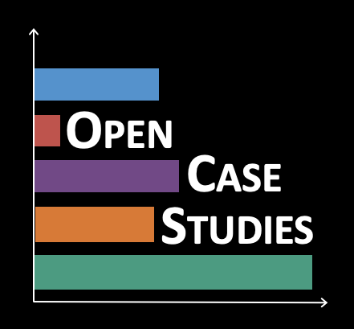
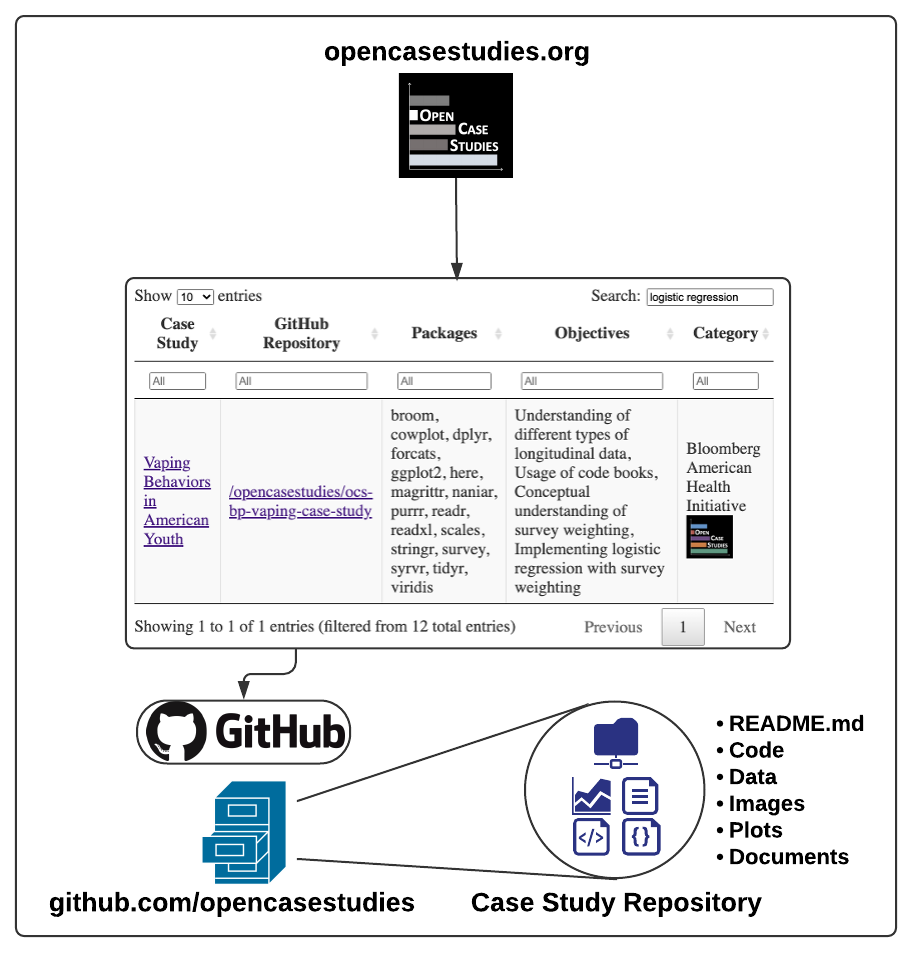
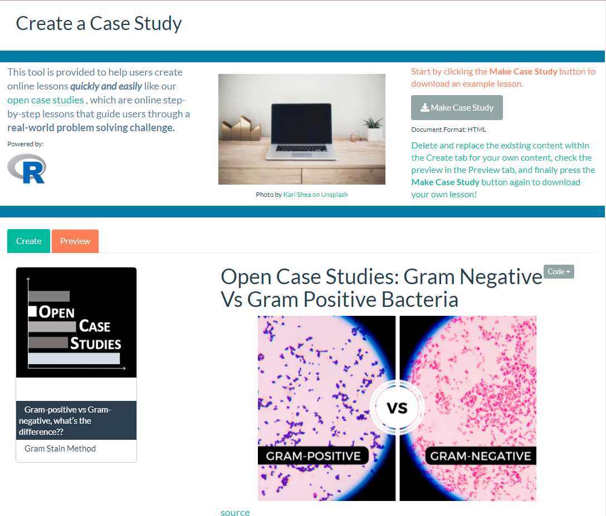

## Open Case Studies | [Johns Hopkins Data Science Lab](https://jhudatascience.org/)

```{r, echo=FALSE, out.width='25%', out.extra='style="float:right;padding:20px"'}

```

[Open Case Studies (OCS)](https://www.opencasestudies.org/) is a repository of open source data science case studies on current public health problems using real datasets. My project is updating the current case studies by removing barriers, implementing interactive elements, and expanding reach. My master's thesis will analyze the impact of these updates on data science education inside and outside the classroom.

&nbsp;
&nbsp;
&nbsp;
&nbsp;
&nbsp;


### OCSdata - R Package

```{r, echo=FALSE, out.width='40%', out.extra='style="float:left;padding:20px"'}

```

All of our case study data is available in their respective [OCS GitHub](https://github.com/opencasestudies) repositories. Accessing the data from 
github can be a confusing process for users unfamiliar with git and leaves room for error. To remove this barrier we've developed [OCSdata](https://github.com/opencasestudies/OCSdata), a package that enables OCS users to download case study data using simple functions all within R. Simply install with the following command: `devtools::install_github("opencasestudies/OCSdata")`

&nbsp;
&nbsp;
&nbsp;
&nbsp;
&nbsp;

<!-- <center> -->
<!-- {width=50%} -->
<!-- </center> -->


### MakeCaseStudies - Webapp

```{r, echo=FALSE, out.width='40%', out.extra='style="float:right;padding:20px"'}

```

To enable our users to create their own digital lessons we developed a webapp called [MakeCaseStudies](https://rsconnect.biostat.jhsph.edu/MakeCaseStudies/) using [Shiny](https://shiny.rstudio.com/). The app has a simple user interface that allows users to copy and paste their content and have it automatically knitted into an HTML document that can easily be hosted on education platforms such as BlackBoard and shared with students. The app opens with default inputs that construct a case study on the Gram stain method to illustrate what can be achieved with the app. Users can change the inputs to their own content and navigate to the 'Preview' tab to inspect the case study being crafted before downloading the HTML file.  

<!-- <center> -->
<!-- {width=50%} -->
<!-- </center> -->

&nbsp;
&nbsp;
&nbsp;
&nbsp;
&nbsp;


<br/><br/>

## Psychiatric Neuroimaging | [Bakker Memory Lab](https://bakkerlab.johnshopkins.edu/index.html)
Worked as a research student under Dr. Farah Naaz and provided programming support for neuroimaging experiments. 

### Random Dot Motion (RDM)
Developed in Matlab a custom script using [Psychtoolbox](http://psychtoolbox.org/) to display RDM as a visual stimulus for subjects under MRI brain scan. This is used to study psychiatric disorders. 

### Brain Imaging Data Structure (BIDS) Converter
Developed Matlab scripts and functions to programmatically convert neuroimaging data folders to the [BIDS standard format](https://bids.neuroimaging.io/). This format is being adopted to support comparisons of imaging data across labs and improve reproducibility. 

&nbsp;
&nbsp;
&nbsp;
&nbsp;
&nbsp;


## NebuFlask: A User-Friendly Nebulizer | [BioInnovation and Design Lab](https://www.scu.edu/engineering/labs--research/labs/bioinnovation-and-design-lab/)
Lead an interdisciplinary team of engineers to design and prototype an upgraded nebulizer for my senior design project. Identified user needs and areas for improvement, created a design to address these needs, and constructed a prototype. Final design made for a lightweight, quiet, rechargeable and discrete nebulizer that would allow for asthma patients to inhale their medications with ease. 

&nbsp;
&nbsp;
&nbsp;
&nbsp;
&nbsp;


## [InCube Labs](https://www.incubelabs.com/)

### Spinal Cord Stimulator for Chronic Pain
Interned at InCube Labs in 2018-2019 and worked on a contract from Boston Scientific to develop a spinal cord stimulator (SCS) for the treatment of intractable, chronic pain. Supported the hardware and software teams' verification and validation process by identifying and removing bugs as well as drafting software specification requirements and test protocols.

